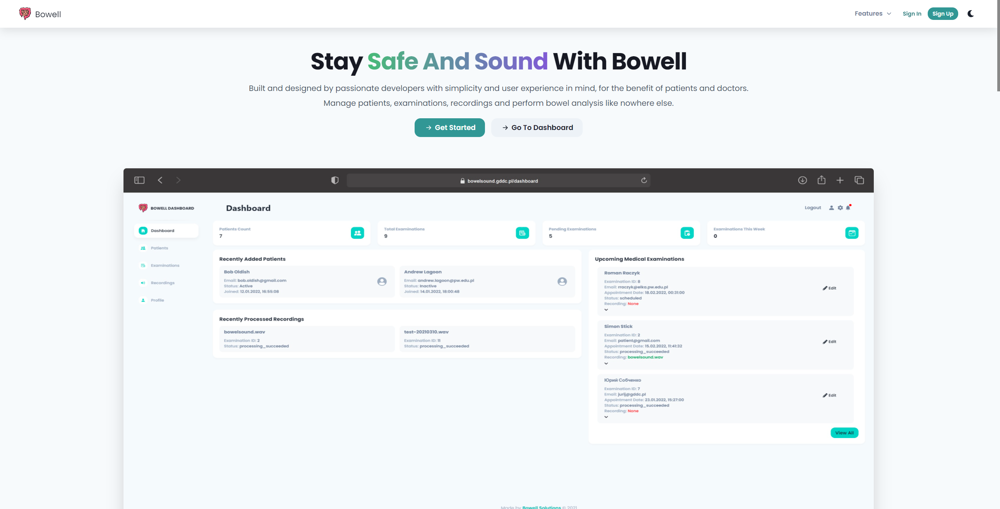

<div align="center" style="padding-bottom: 10px">
    <h1>Bowell Frontend</h1>
    
    
        
    
        
    
    
        
    
    
</div>

<div align="center" style="padding: 20px 0">
    
</div>

## Tools, libraries, frameworks:

This setup uses Node 14 and yarn.

### Frontend

- `next`, `typescript` Next JS with Typescript
- `axios` - HTTP client
- `redux`, `react-redux`, `@reduxjs/toolkit`, `next-redux-wrapper` - (global) state management
- `sass` - Scss support
- `chakra-ui` + dependencies (such as `emotion`, `framer-motion`) - UI libraries
- `formik`, `yup` - form validation
- `react-use-websockets` - websocket client
- `react-dropzone` - drop zone component used for file upload
- `recharts` - plots
- `jest` + dependencies - unit tests
- `cypress` + dependencies - E2E testing  
and more...

#### Third Party Dependencies:
While designing the dashboard, we took inspiration from free version of 
[Purity UI Dashboard](https://github.com/creativetimofficial/purity-ui-dashboard) 
created by [CreativeTim](https://www.creative-tim.com/), also licensed under MIT.
All the code we used had been rewritten to Typescript, reformatted and refactored.
Most of our components are self-written and only a few components come from the mentioned source.   

All images are either self created or come from [stock](https://www.pexels.com/) photos and are royalty free.  

[Favicon and logo](https://www.flaticon.com/free-icon/intestine_2044752?term=intestine&page=1&position=8&page=1&position=8&related_id=2044752&origin=tag) 
are available for personal and commercial use under Flaticon License.

## File Structure

Click [here](FILES.md) to read project's file structure documentation.

## Development setup

Environmental variables in .env.local

```
API_URL=http://127.0.0.1:8000/api
API_ACCESS_TOKEN_LIFETIME=3600
```

### Without Docker

Install dependencies

```shell
yarn install
```

Run development server

```shell
yarn dev
```

#### Running tests:

Jest (unit tests)

```shell
yarn test
```

Cypress (e2e tests) - multiple ways to run:

```shell
yarn e2e                  # with dev server
yarn e2e:headless         # windowless cypress with dev server
yarn e2e:prod             # cypress with production build
yarn e2e:prod:headless    # windowless cypress with production build
```


### With Docker

Add `.babelrc` file in root directory with this content (if not present):

```json
{
  "presets": ["next/babel"]
}
```

This will disable SWC, which does not work on Alpine, even after installing missing libraries
(musl vs glibc issue).

Make sure Docker Engine is running.

While in root directory, build docker images and run them with docker-compose. This might take up to few minutes.
Rebuilding image is crucial after installing new packages via yarn/npm.

```shell script
docker-compose up --build
```

Client application should be up and running at `127.0.0.1:3000`.

If docker images are installed and **no additional packages have been installed**, just run to start containers:

```shell script
docker-compose up
```

Bringing down containers

```shell script
docker-compose down
```

To run commands in an active container:

```shell script
docker exec -it frontend <command>
```
