

    <h1>Bowell's User Interface</h1>

    <h2>Landing page and auth routes</h2>

    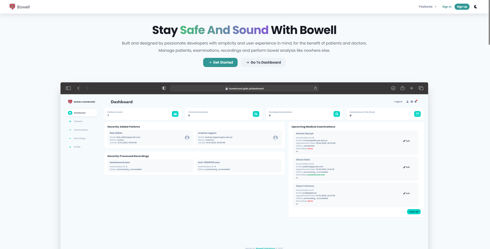

    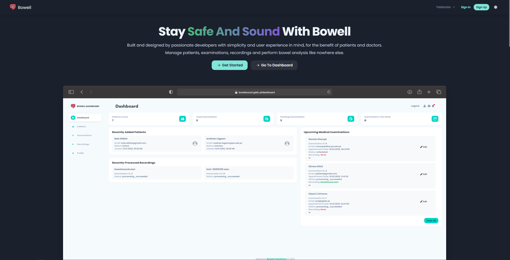    

        

        

    <h2>Doctor's dashboard</h2>

    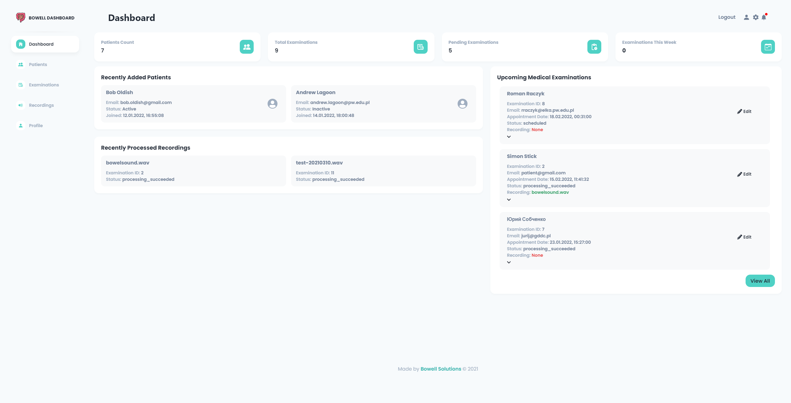    

    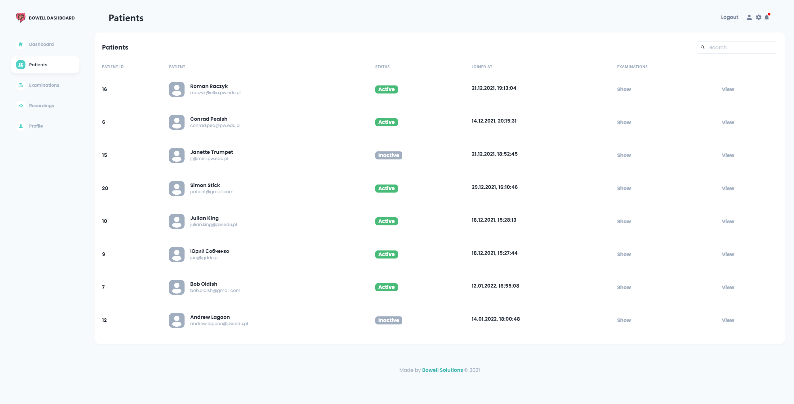    

    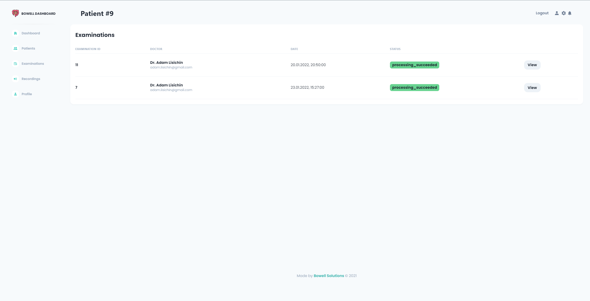    

    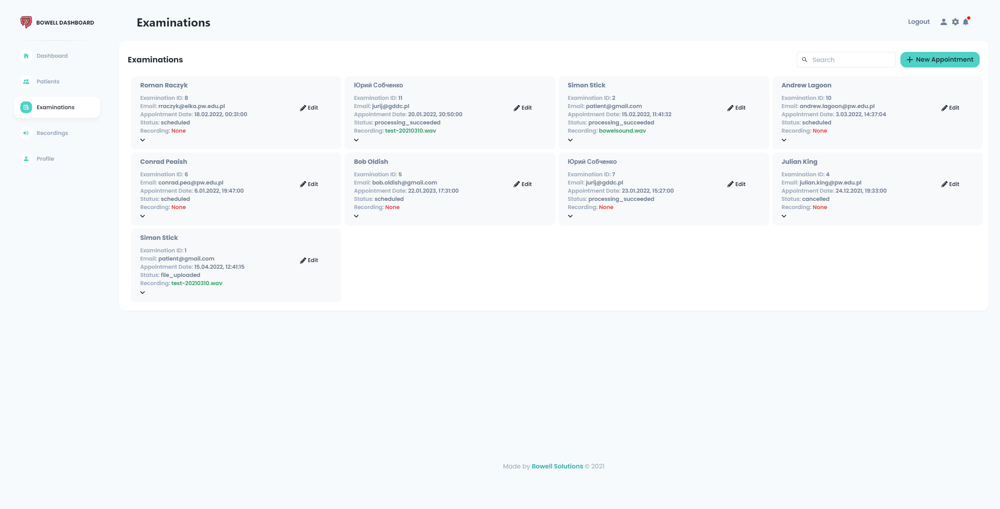    

        

    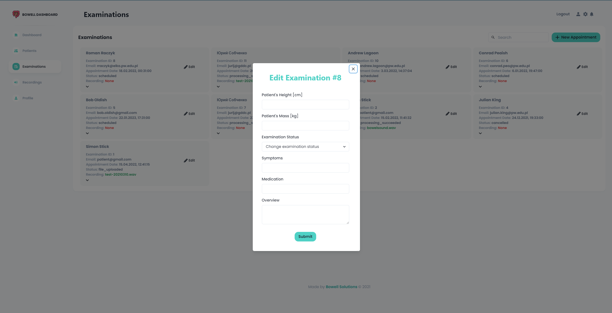    

    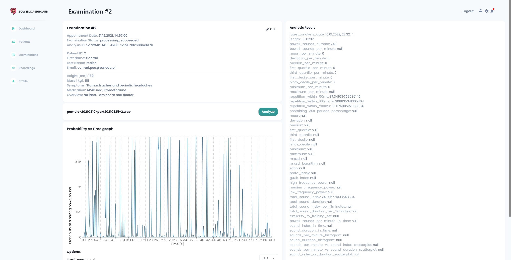    

    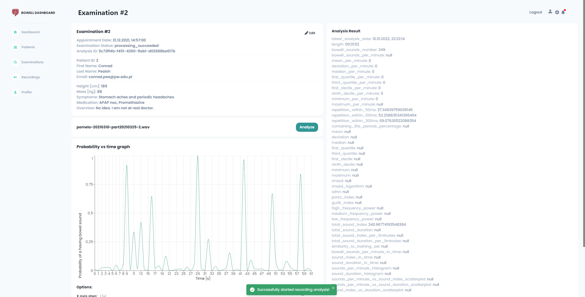    

    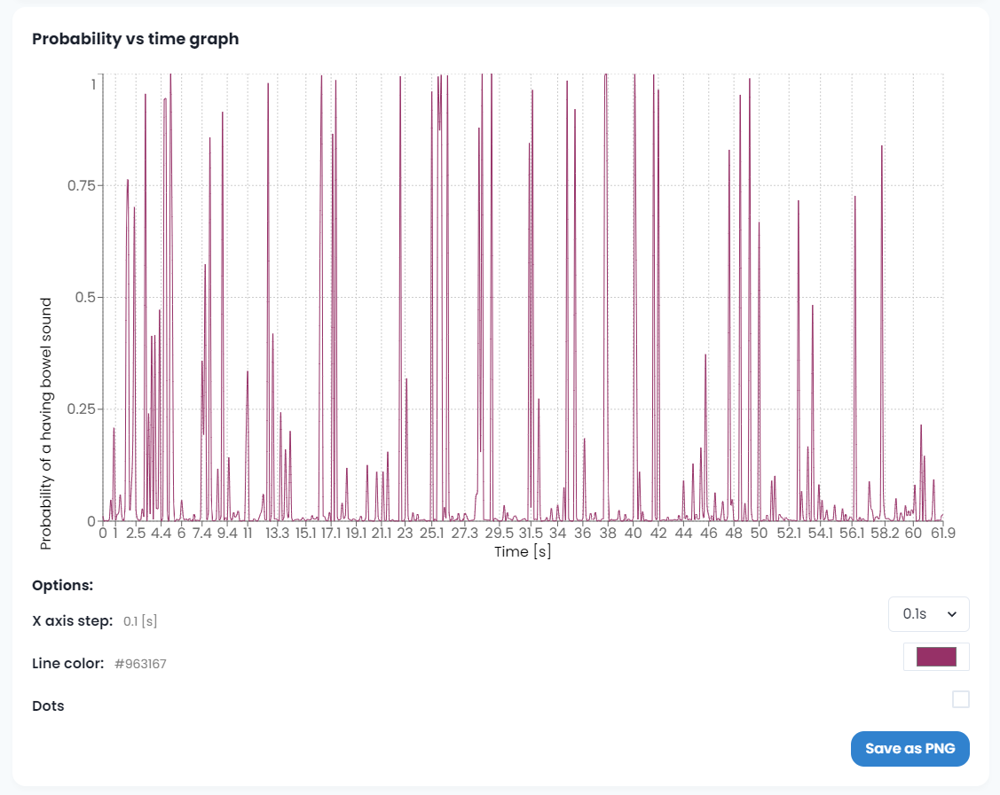    

    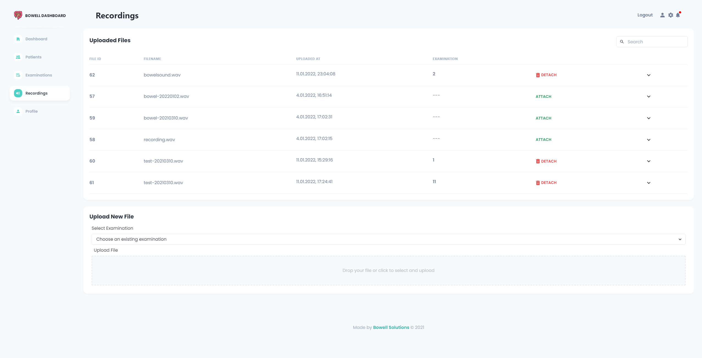    

    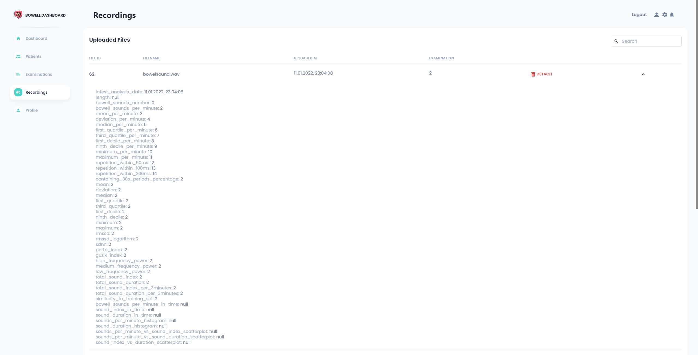    

        

        

    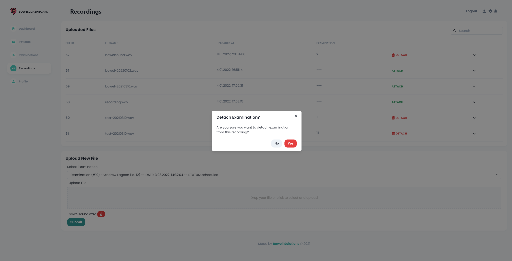    

    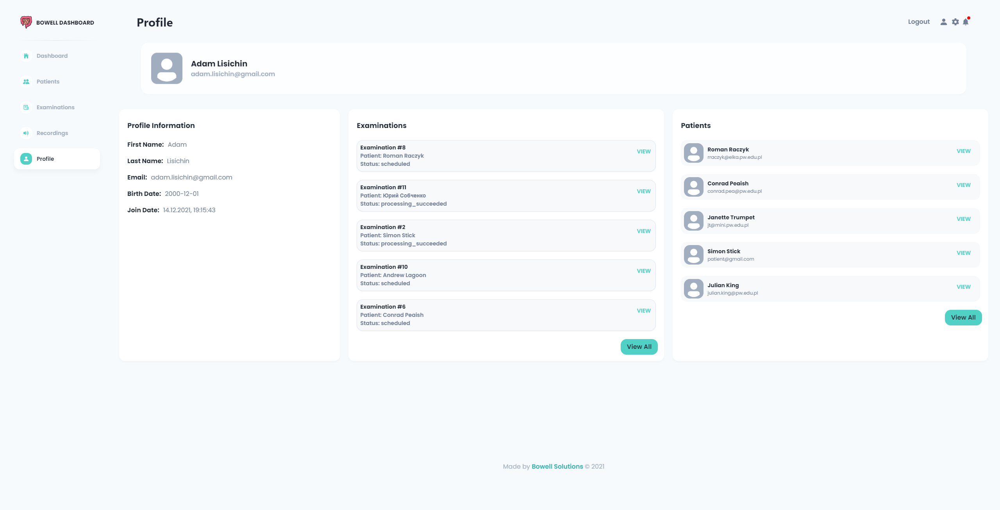    

    <h2>Patient's dashboard</h2>

    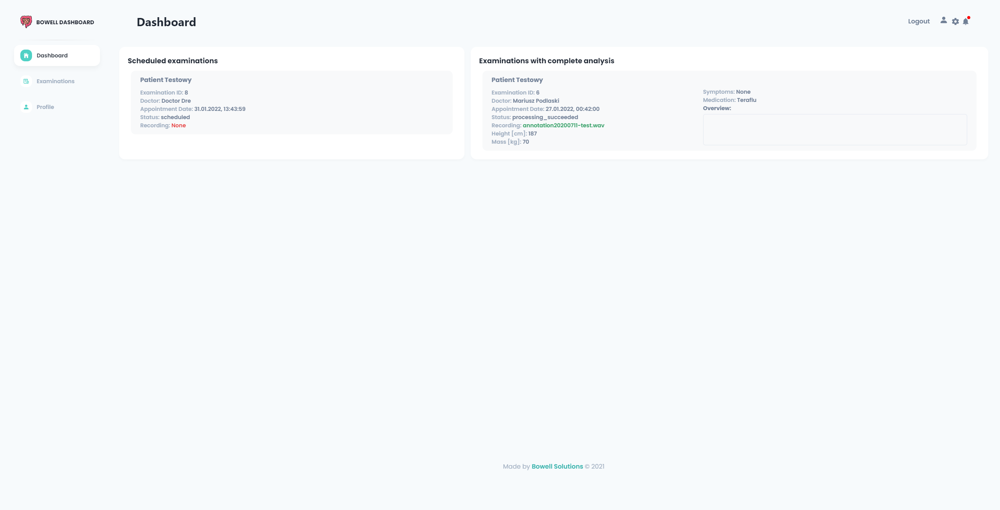    

    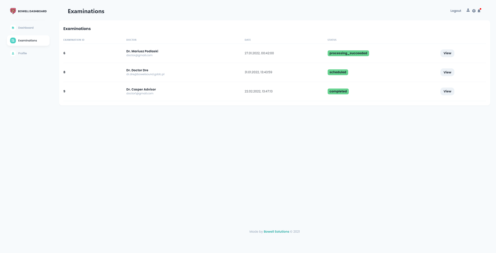    

    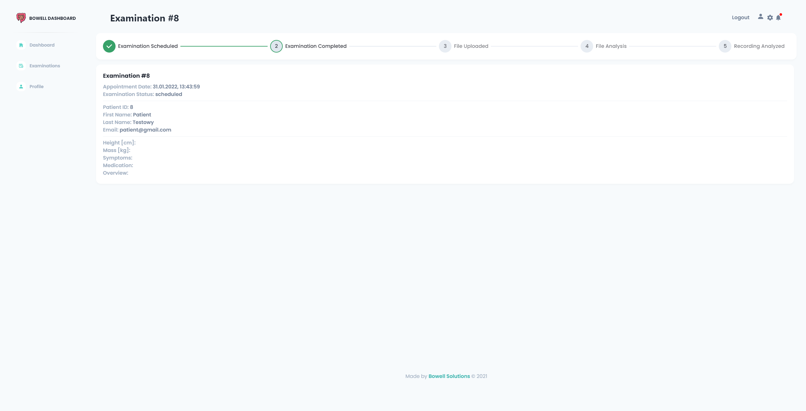    

    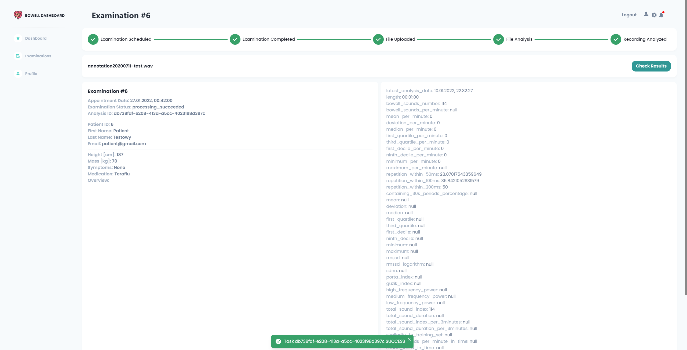    

    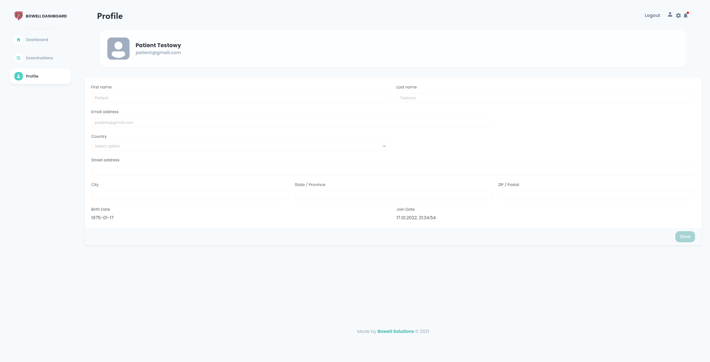    

